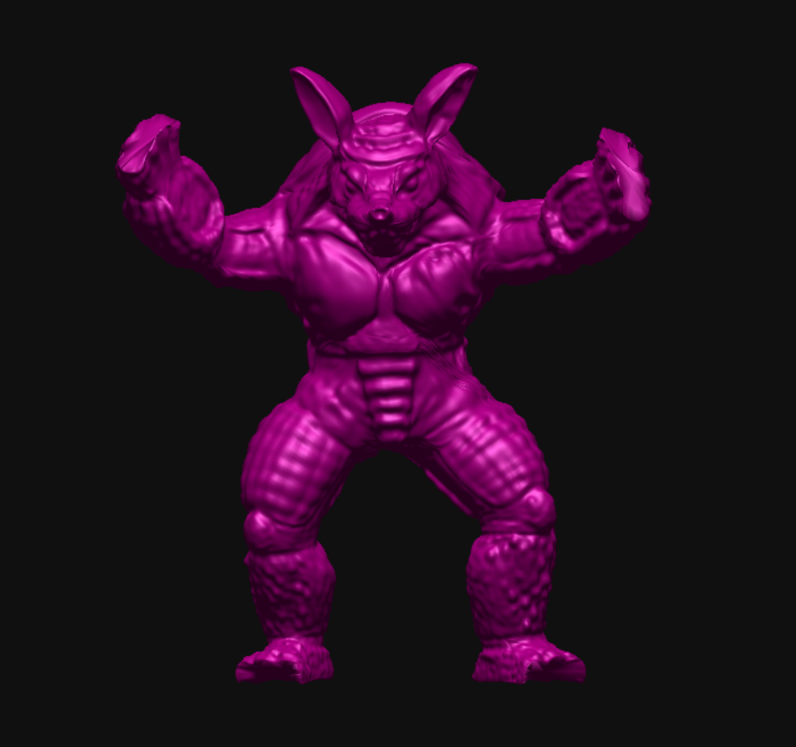
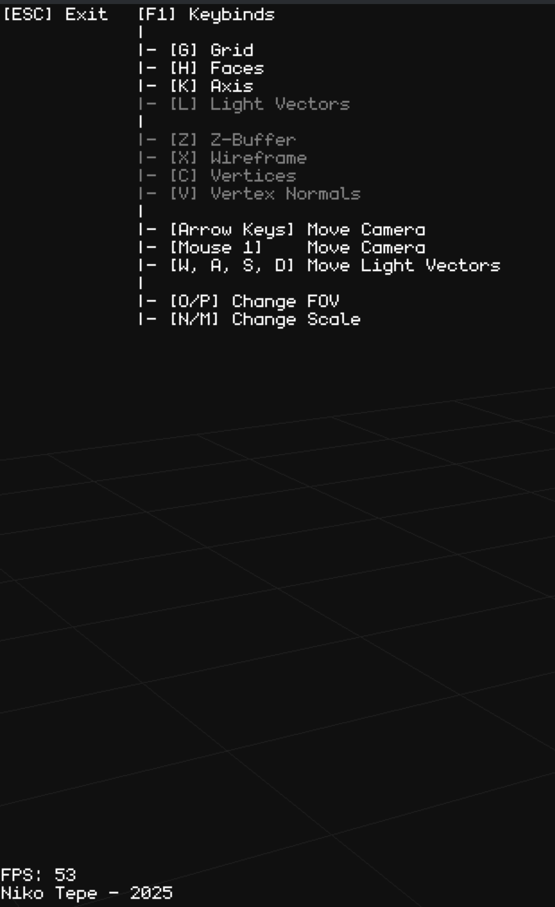

# Rust Graphics Engine


A 3D software rendering engine built from scratch in Rust. Implements a custom graphics pipeline, linear algebra library, and scene graph without hardware acceleration APIs.

Based on concepts from *Computer Graphics from Scratch* by Gabriel Gambetta and university course materials.

## 🖼️ Gallery & Render Modes

Click on any image to view the full-resolution version.

### F-16 Render Modes
Comparison of different pipeline stages and rendering modes implemented in the engine.

<table>
  <tr>
    <td align="center">
      <a href="screenshots/f-16wireframe%20mode.jpeg">
        
      </a>
      <br />
      <sub>Wireframe</sub>
    </td>
    <td align="center">
      <a href="screenshots/f-16%20vertex%20mode.jpeg">
        
      </a>
      <br />
      <sub>Vertex Plot</sub>
    </td>
    <td align="center">
      <a href="screenshots/f-16%20vertex%20normal%20mode.jpeg">
        
      </a>
      <br />
      <sub>Vertex Normals</sub>
    </td>
  </tr>
  <tr>
    <td align="center">
      <a href="screenshots/f-16%20face%20mode.jpeg">
        
      </a>
      <br />
      <sub>Face Rendering</sub>
    </td>
    <td align="center">
      <a href="screenshots/f-16%20zbuffer%20mode.jpeg">
        
      </a>
      <br />
      <sub>Z-Buffer Visualization</sub>
    </td>
    <td align="center">
      </td>
  </tr>
</table>

### Model Showcase & GUI

<table>
  <tr>
    <td align="center">
      <a href="screenshots/armadillo.jpeg">
        
      </a>
      <br />
      <sub>Armadillo</sub>
    </td>
    <td align="center">
      <a href="screenshots/dragon%20zbuffer%20mode.png">
        
      </a>
      <br />
      <sub>Dragon (Z-Buffer)</sub>
    </td>
  </tr>
  <tr>
    <td align="center">
      <a href="screenshots/suzanne%20face%20mode.jpeg">
        
      </a>
      <br />
      <sub>Suzanne (Face Mode)</sub>
    </td>
    <td align="center">
      <a href="screenshots/tyra%20vertex%20mode.jpeg">
        
      </a>
      <br />
      <sub>Tyra (Vertex Mode)</sub>
    </td>
  </tr>
</table>

**User Interface**

<a href="screenshots/gui.png">
  
</a>

## ✨ Features

* **Software Rasterization**: Custom implementation of the graphics pipeline (`src/renderer/rasterizer.rs`) handling triangle projection and pixel drawing.
* **Interactive Scene Graph**: Runtime manipulation of objects (Translate, Rotate, Scale) with support for hierarchical selection.
* **Dynamic Lighting**: Move and rotate light sources in real-time to test shading.
* **Custom Math Library**: Hand-rolled Vector, Matrix, and Geometry implementations (`src/types/math`) to handle 3D transformations.
* **Robust Input System**: Custom state-tracking wrapper around `minifb`, enabling distinct checks for Pressed, Held, and Released states.

## 📂 Project Structure

* **`src/engine.rs`**: The main game loop and engine lifecycle management.
* **`src/renderer/`**: The core rendering pipeline.
    * `rasterizer.rs`: Converts projected triangles into pixels (Barycentric/Edge functions).
    * `draw_command.rs`: Handles the queue of drawing operations.
    * `frustum.rs`: Handles view culling.
* **`src/types/math/`**: Linear algebra library (Matrices, Vectors, Points).
* **`src/scene/`**: Manages objects in the world, bounding boxes, and scene nodes.

## 🚀 Getting Started

### Prerequisites
* **Rust**: Ensure you have the latest stable version of Rust and Cargo installed.

### Installation

1.  Clone the repository:
    ```bash
    git clone [https://github.com/JoeKL/rust_graphics.git](https://github.com/JoeKL/rust_graphics.git)
    cd rust_graphics
    ```

2.  Run the engine:
    ```bash
    cargo run --release
    ```
    > **Note:** The `--release` flag is highly recommended. Since this is a software renderer doing heavy math on the CPU, debug builds may be significantly slower.

## 🤝 Contributing

This is an educational project, but contributions are welcome!

1.  Fork the Project
2.  Create your Feature Branch (`git checkout -b feature/AmazingFeature`)
3.  Commit your Changes (`git commit -m 'Add some AmazingFeature'`)
4.  Push to the Branch (`git push origin feature/AmazingFeature`)
5.  Open a Pull Request

## 📄 License

Distributed under the MIT License. See `LICENSE` for more information.

## Model Source

https://github.com/alecjacobson/common-3d-test-models
